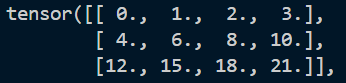
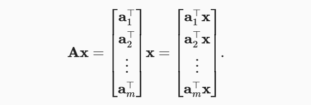
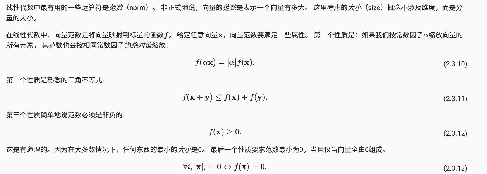

# pandas
Pandas 是 Python 编程语言中一个极其强大且流行的开源数据分析和操作库。

pandas会提供pd.read_csv(),pd.read_excel(), pd.to_csv(), pd.to_excel()来读取数据

## iloc
使用iloc方法，实现索引，但iloc 是 Pandas 索引器对象（Indexer object），不是函数。它是 DataFrame 和 Series 对象的一个特殊属性，当你在对象后使用 [] 时，Python 实际上会调用该对象的 __getitem__() 方法。
```py
part = data.iloc[:,0]
```

## fillna
在数据处理中，我们会遇到NaN，它代表着缺少值，但我们是不允许有缺失值的，所以我通常采用**插值法**或者**删除法**，插值法关键函数fill na

## 独热编码one-hot
将离散的分类标签，转换为二进制表示

如果我们做分类，把每个类别写成0 1 2 3 4这样是不可以的，这样会导致距离不对等，相邻的差1，但随着距离增加就更大

所以采用one-hot独热编码，每一个类别用一个二进制表示，0001 0010 0100 1000，这样在空间内他们都是正交的，距离也就相等了

## 转化tensor

注意pandas的data属于DataFrame的类型，无法直接转换成pytorch的tensor，需要先转换为numpy的数组

并且也会自动处理Pave 和 NAN 的类型

其次对二维tensor可以使用转置
```py
A = torch.tensor()
A.T
```

可是使用A.sum() 求和 A.size()求个数 A.mean()求均值

同样可以沿着轴降低维度
## 张量算法

python中要尽量减少 A = B这个操作，这样A和B会指向同一个地址，如果你想的是复制值 应该 A = B.clone()，就不会
### 降维
使用sum的成员函数，如果什么参数不传，默认全部求和，但是可以指定axis，进行降维，他会按照你给定的axis，**输入轴的维数在输出形状中消失**。例如你输入0，那么它会把每一列都加在一起

### 非降维求和

sum里面含有着keepdim的参数，默认False，设置为True可以不改变维度，只改变shape，而求和

### 累计求和函数

cumsum
```py
A.cumsum(dim=0,dtype=float)
```
它指定累计求dim0的和，那么它会每一行会加上上一行的数值


## 点积

A · B = AB（T）
使用torch.dot可以使用点积,主要点积只可以操作1维的tensor，

点积在求加权数的时候很有应用必要，

也可以使用torch.sum(x * y)替代

## 矩阵-向量积
torch.mv(matrix & vector)


## 矩阵-矩阵积
torch.mm(A, B)

## 范数
线性代数中最有用的一些运算符是范数（norm）。 非正式地说，向量的范数是表示一个向量有多大。 这里考虑的大小（size）概念不涉及维度，而是分量的大小。

L1范数是所有向量元素的绝对值和，L2是所有向量的元素的平方和的根号

```py
#L1
np.abs(u).sum()
#L2
np.norm()
```

## 拟合模型的关键任务

优化（optimization）：用模型拟合观测数据的过程；

泛化（generalization）：数学原理和实践者的智慧，能够指导我们生成出有效性超出用于训练的数据集本身的模型。
