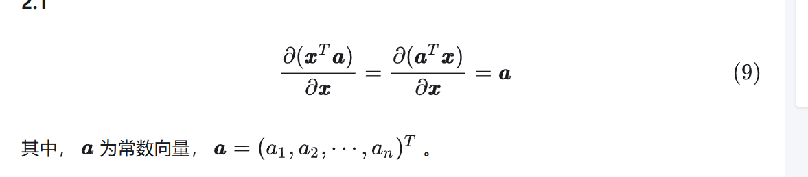
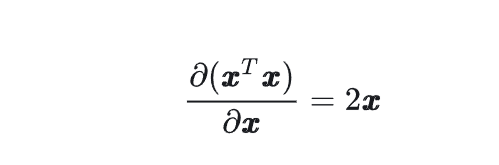
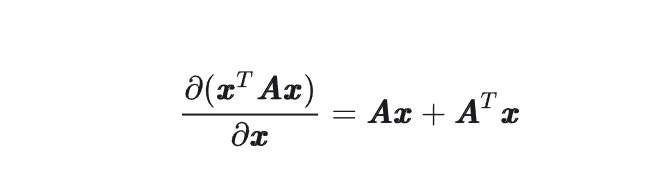
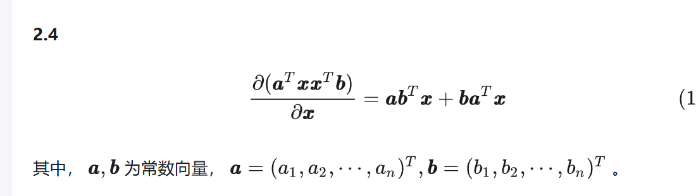
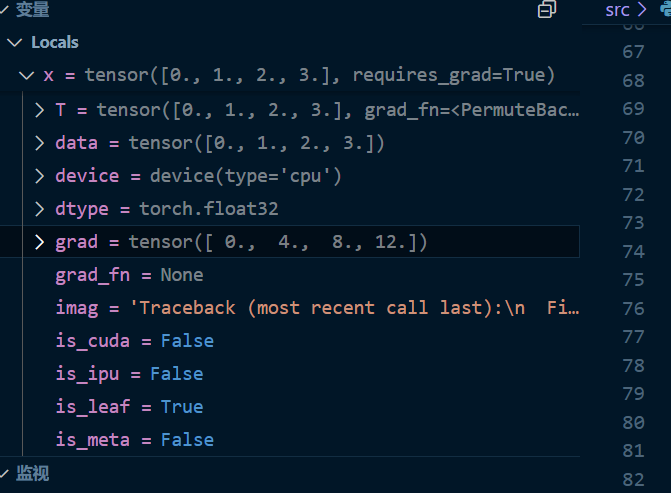

# 补习一点导数知识
## 标量对标量
求导后还是标量
## 标量对向量
求导后是与向量一样shape的向量
## 向量对向量
矩阵 矩阵/更高维度
### 正向求导
从x一层层求到f（x）
因为深度学习需要储存全部的正向中间结果，所以它特别耗CPU资源，这是罪魁祸首
### 反向求导
从f（x）一层层往x去求导


## 其他
求导是要分成计算图，一步步，按照链式法则求导，正反向的图还不一样

## 补充基础
[矩阵求导](https://zhuanlan.zhihu.com/p/263777564)

重要公式截图摘出







https://zhuanlan.zhihu.com/p/273729929

https://zhuanlan.zhihu.com/p/288541909
# 代码

```py
import torch

x = torch.arange(4.0,requires_grad=True)
print(x.grad)
y = 2* torch.dot(x,x)
#如果 x 是 1维向量（如 shape=[n]），直接使用 x 即可，无需转置（因为向量点积 torch.dot(x, x) 不需要转置）
y.backward()
print(y)
```

计算一个f（x）对x梯度之前，需要一个地方来存储梯度，当我们设置x为required_grad为True,那么就会存储在如下地方，默认为None


要提醒的是，pytorch会累计grad，所以需要进行zero操作
x.grad.zero_()
注意如果x并无grad，即grad是None而不是0，并无zero_这个办法，会发生报错
使用了zero_,不是回到None，而是真变成0
## 关于非标量变量的反向传播
当y不是标量时，向量y关于向量x的导数的最自然解释是一个矩阵。 对于高阶和高维的y和x，求导的结果可以是一个高阶张量。 但当调用向量的反向计算时，我们通常会试图计算一批训练样本中每个组成部分的损失函数的导数。 这里，我们的目的不是计算微分矩阵，而是单独计算批量中每个样本的偏导数之和。

其实拿到的还是标量

```py
# 对非标量调用backward需要传入一个gradient参数，该参数指定微分函数关于self的梯度。
# 本例只想求偏导数的和，所以传递一个1的梯度是合适的
x.grad.zero_()
y = x * x
# 等价于y.backward(torch.ones(len(x)))
y.sum().backward()
x.grad
```

## 分离计算
有时，我们希望将某些计算移动到记录的计算图之外。假设y是作为x的函数计算的，而z则是作为y和x的函数计算的。 想象一下，我们想计算z关于x的梯度，但由于某种原因，希望将y视为一个常数。
该怎么办

可以使用y.detach()函数即可视为常量，y.detach() 是 PyTorch 中的一个方法，用于从计算图中分离张量 y，返回一个与 y 共享数据但不参与梯度计算的新张量。

有什么用处，以后便于我们讲网络的一部分参数以此固定住，不随训练而改变

