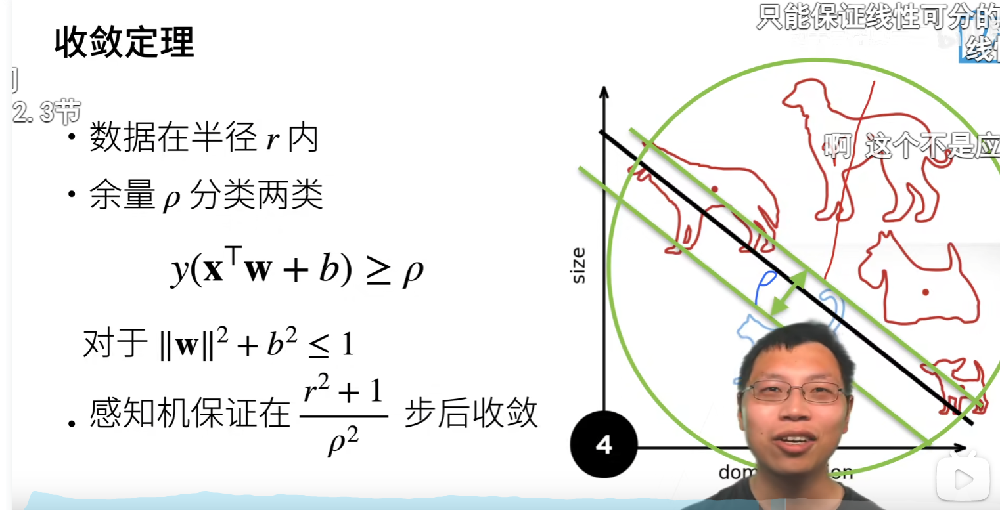
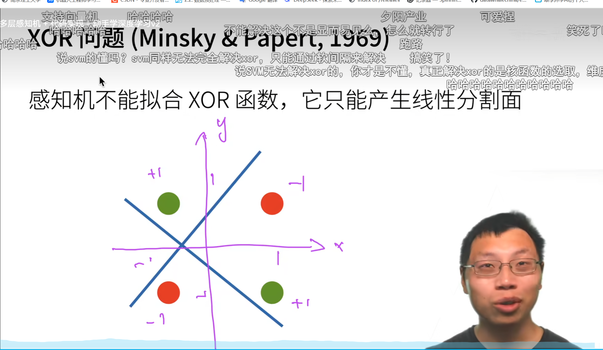
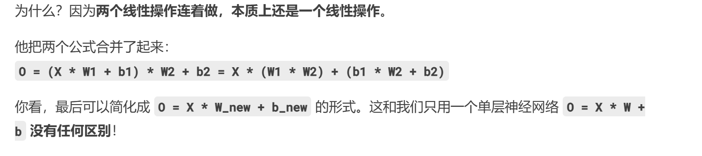
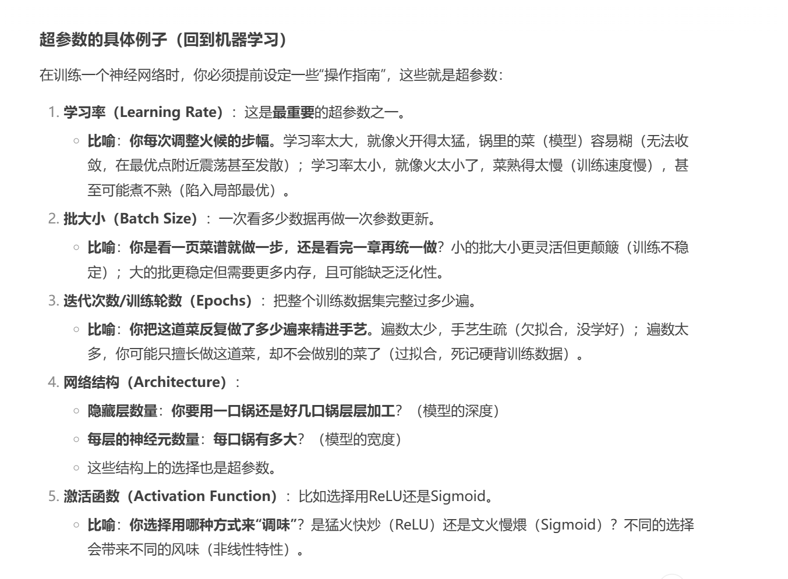

# 感知机
感知机是二分类的线性模型。假设训练数据集是线性可分的，感知机学习的目标是求得一个能够将训练数据集正实例点和负实例点完全正确分开的分离超平面。感知机学习算法具有简单而易于实现的优点，分为原始形式和对偶形式

并且感知机一个个扫数据，并不像现在神经网络具有batch_size

它有个收敛定理

但是这个是XOR问题，这个不能通过单纯的感知机解决，因为它不是线性问题，所谓线性问题，不可以用一条直线进行分割

所以人们引入多层感知机
# 多层感知机
MLP（Multilayer Perception），是基于前馈神经网络的深度学习模型。多层感知机（Multilayer Perceptron，简称MLP），是一种基于前馈神经网络（Feedforward Neural Network）的深度学习模型，由多个神经元层组成，其中每个神经元层与前一层全连接。多层感知机可以用于解决分类、回归和聚类等各种机器学习问题。
多层感知机的每个神经元层由许多神经元组成，其中输入层接收输入特征，输出层给出最终的预测结果，中间的隐藏层用于提取特征和进行非线性变换。每个神经元接收前一层的输出，进行加权和和激活函数运算，得到当前层的输出。通过不断迭代训练，多层感知机可以自动学习到输入特征之间的复杂关系，并对新的数据进行预测。

MLP赋予了神经网络可以应对非线性问题的强大能力，例如在卷积神经网络后面，会有很多隐藏层，第一个隐藏层负责组合像素学习到一些简单的边缘，第二层负责组合边缘学习到纹理

要明白两个道理，一是单纯堆积线性层的个数是没用的

二是引入激活函数可以避免这个问题

也就是引入了非线性

# 番外：超参数

在神经网络中如下

隐藏层的大小也是超参数