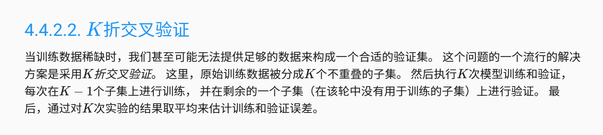
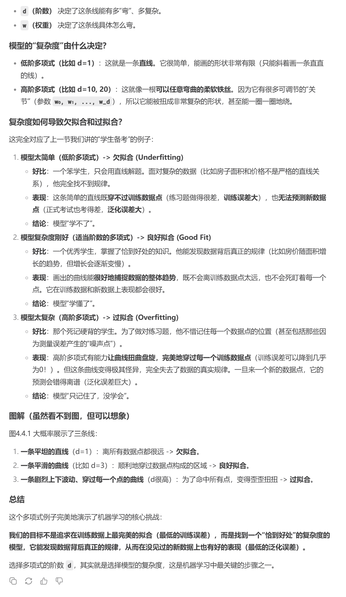

# 训练误差和泛化误差
训练误差（training error）是指， 模型在训练数据集上计算得到的误差。 泛化误差（generalization error）是指， 模型应用在同样从原始样本的分布中抽取的无限多数据样本时，模型误差的期望。

通俗解释训练误差就是看你死记硬背的能力，泛化误差就是指的你应对你没遇到过的题，出现错误的期望，最好的训练就是训练误差等于泛化误差

# 模型选择

## 训练集 验证集 测试集
我们可以用学生考试理解

训练集就是学生平时的练习题

验证集就是模拟考试

测试集就是高考

# k折验证集、


# 过拟合 欠拟合
还可以通过模型复杂性来看欠拟合和过拟合问题



# 实例 细细体会

```py
import torch
import numpy as np
import math
from torch import nn as nn
from d2l import torch as d2l

max_degree = 20
n_train, n_test = 100, 100

true_W = np.zeros(max_degree)
true_W[0:4] = [5, -1.2, -3.4, 5.6]

test = np.random.normal(size=(n_train + n_test, 1))
np.random.shuffle(test)
ploy_features = np.power(
    test, np.arange(max_degree).reshape(1, -1)
)  # 这个power也可以广播操作
for i in np.arange(max_degree):
    ploy_features[:, i] /= math.gamma(i + 1)  # gamma(n)=(n-1)!
labels = np.dot(ploy_features, true_W)
labels += np.random.normal(scale=0.1, size=labels.shape)

true_W, test, ploy_features, labels = [
    torch.tensor(x, dtype=torch.float32) for x in [true_W, test, ploy_features, labels]
]


def train(train_features, test_features, train_labels, test_labels, num_epochs=400):
    loss = nn.MSELoss(reduction="none")
    input_shape = train_features.shape[-1]  # 这个shape填入参数可以返回指定维度的大小
    net = nn.Sequential(
        nn.Linear(input_shape, 1, bias=False)
    )  # 在初始化参数的时候，已经涵盖了
    trainer = torch.optim.SGD(net.parameters(), lr=0.01)
    batch_size = min(10, train_labels.shape[0])
    train_iter = d2l.load_array(
        (train_features, train_labels.reshape(-1, 1)), batch_size
    )
    test_iter = d2l.load_array(
        (test_features, test_labels.reshape(-1, 1)), batch_size, is_train=False
    )

    animator = d2l.Animator(
        xlabel="epoch",
        ylabel="loss",
        yscale="log",
        xlim=[1, num_epochs],
        ylim=[1e-3, 1e2],
        legend=["train", "test"],
    )
    # 创建动画可视化器，用于绘制训练和测试损失曲线x轴: 训练轮数 y轴: 损失值(对数尺度) 显示训练和测试两条曲线
    for epoch in range(num_epochs):
        d2l.train_epoch_ch3(net, train_iter, loss, trainer)
        if epoch == 0 or (epoch + 1) % 20 == 0:
            animator.add(
                epoch + 1,
                (
                    d2l.evaluate_loss(net, train_iter, loss),
                    d2l.evaluate_loss(net, test_iter, loss),
                ),
            )
    print('weight:', net[0].weight.data.numpy())

# 从多项式特征中选择前4个维度，即1,x,x^2/2!,x^3/3!
train(
    ploy_features[:n_train, :6],
    ploy_features[n_train:, :6],
    labels[:n_train],
    labels[n_train:],
)
d2l.plt.show()
```

