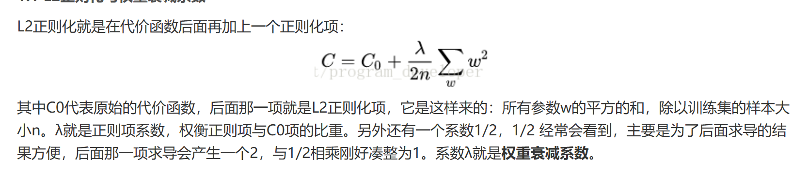
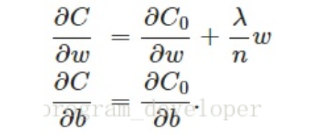
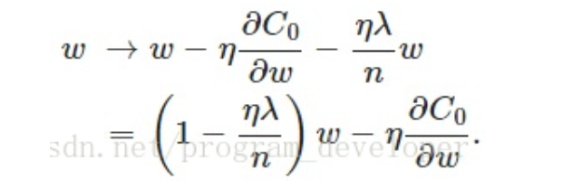
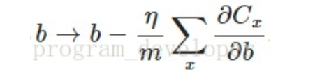

# 原理讲解
参考：https://blog.csdn.net/program_developer/article/details/80867468


在训练参数的时候，有一项很重要避免过拟合的技术叫做权重衰减，也成为L2正则化，这项技术通过函数与零的距离来衡量函数的复杂度

就是在损失函数中添加一项，范数L2的平方再/2（除以2便于求导化简），


更神奇的是，这种正则化，对损失函数（前提是必须要有权重和偏置，对于没有这种可训练参数的，会用其他正则化）对于优化的参数求导中，只对权重项于原来相比有影响

所以在随机梯度下降更新的时候，会发生w有影响、b无影响



# 为什么是L2不是L1

原因是L2对权重向量的大分量有着更大的惩罚（平方的存在）

# 实例
```py
def train_concise(wd):
    net = nn.Sequential(nn.Linear(num_inputs, 1))
    for param in net.parameters():
        param.data.normal_()
    loss = nn.MSELoss(reduction='none')
    num_epochs, lr = 100, 0.003
    # 偏置参数没有衰减
    trainer = torch.optim.SGD([
        {"params":net[0].weight,'weight_decay': wd},
        {"params":net[0].bias}], lr=lr)
    animator = d2l.Animator(xlabel='epochs', ylabel='loss', yscale='log',
                            xlim=[5, num_epochs], legend=['train', 'test'])
    for epoch in range(num_epochs):
        for X, y in train_iter:
            trainer.zero_grad()
            l = loss(net(X), y)
            l.mean().backward()
            trainer.step()
        if (epoch + 1) % 5 == 0:
            animator.add(epoch + 1,
                         (d2l.evaluate_loss(net, train_iter, loss),
                          d2l.evaluate_loss(net, test_iter, loss)))
    print('w的L2范数：', net[0].weight.norm().item())
```