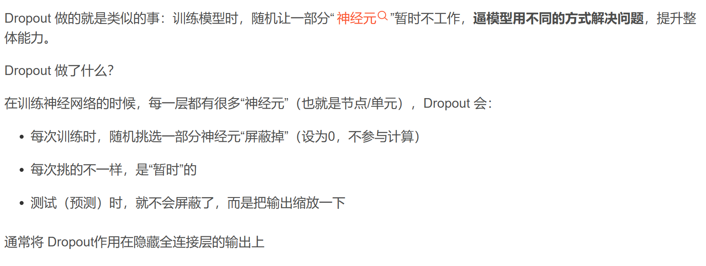
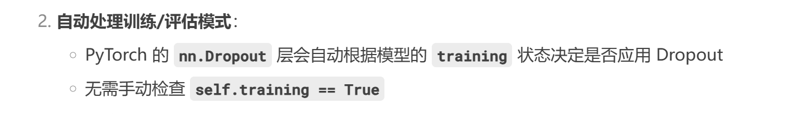

# 线性模型的不足
当面对更多的特征而样本不足时，线性模型往往会过拟合。 相反，当给出更多样本而不是特征，通常线性模型不会过拟合。 不幸的是，线性模型泛化的可靠性是有代价的。 简单地说，线性模型没有考虑到特征之间的交互作用。 对于每个特征，线性模型必须指定正的或负的权重，而忽略其他特征。
# 神经网络的优势
 与线性模型不同，神经网络并不局限于单独查看每个特征，而是学习特征之间的交互。

泛化性和灵活性之间的这种基本权衡被描述为偏差-方差权衡
# 定义一个好的预测模型
 我们期待“好”的预测模型能在未知的数据上有很好的表现： 经典泛化理论认为，为了缩小训练和测试性能之间的差距，应该以简单的模型为目标。

 简单性的另一个角度是**平滑性**，即函数不应该对其输入的微小变化敏感。

 上面换句话说就是对随机的噪声不受干扰才好

 例如，当我们对图像进行分类时，我们预计向像素添加一些随机噪声应该是基本无影响的。

# 背景来了
然后在2014年，斯里瓦斯塔瓦等人 (Srivastava et al., 2014) 就如何将毕晓普的想法应用于网络的内部层提出了一个想法： 在训练过程中，他们建议在计算后续层之前向网络的每一层注入噪声。 因为当训练一个有多层的深层网络时，注入噪声只会在输入-输出映射上增强平滑性。

这是增加平滑性的背景了，这个方法也叫做暂退法

**暂退法在前向传播过程中，计算每一内部层的同时注入噪声，这已经成为训练神经网络的常用技术。**

# 暂退法解释
https://blog.csdn.net/m0_61360701/article/details/146764916?spm=1001.2101.3001.6650.2&utm_medium=distribute.pc_relevant.none-task-blog-2%7Edefault%7EOPENSEARCH%7ERate-2-146764916-blog-140667616.235%5Ev43%5Econtrol&depth_1-utm_source=distribute.pc_relevant.none-task-blog-2%7Edefault%7EOPENSEARCH%7ERate-2-146764916-blog-140667616.235%5Ev43%5Econtrol&utm_relevant_index=3

这有个教程

# 使用
self.dropout = nn.Dropout(0.5)
x = self.dropout(x)  

传入一个参数，它代表着概率，在训练是以这个概率随机丢弃掉一些神经元、在测试时启动全部神经元，但是为了保持一致性，输出的值会根据训练时丢弃的比例进行缩放。比如，如果训练时使用 50% 的 dropout，测试时输出的值会乘以 0.5。

# 补充
prod是联乘