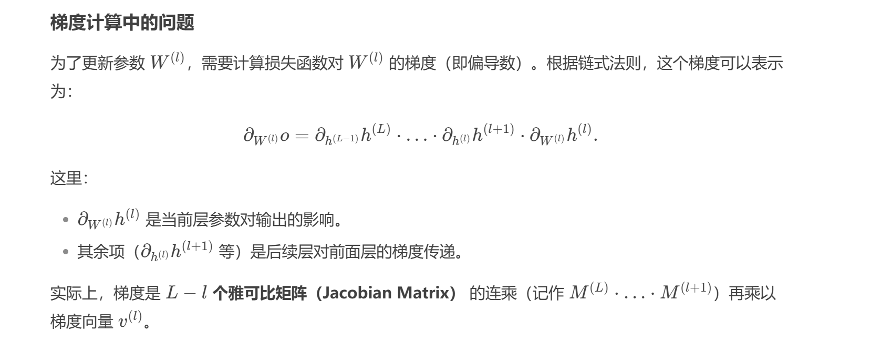
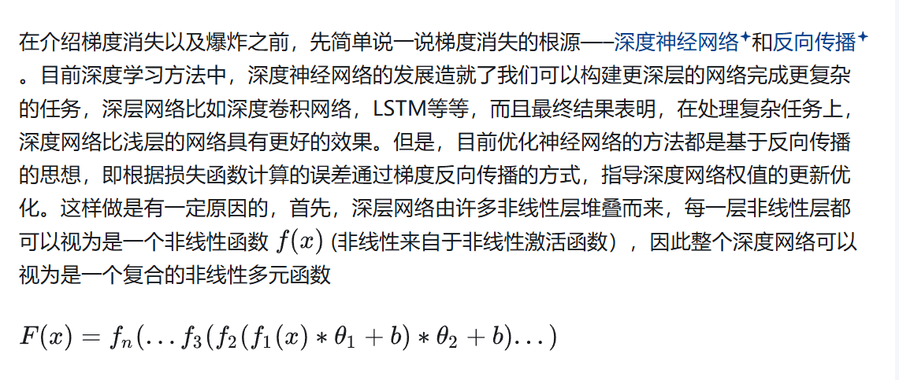
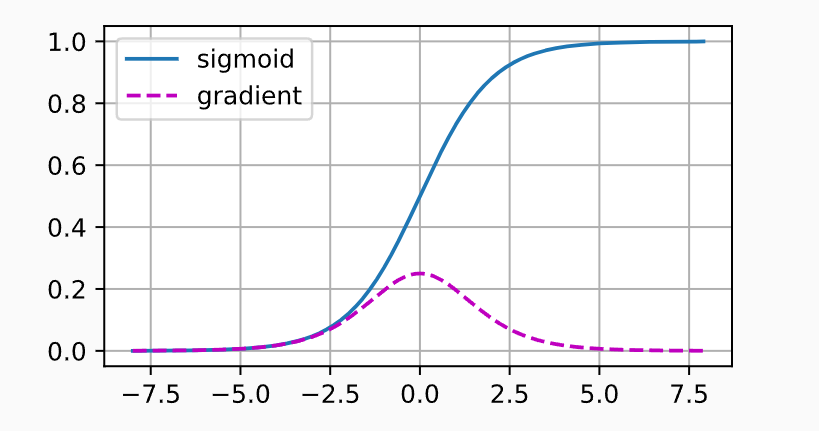
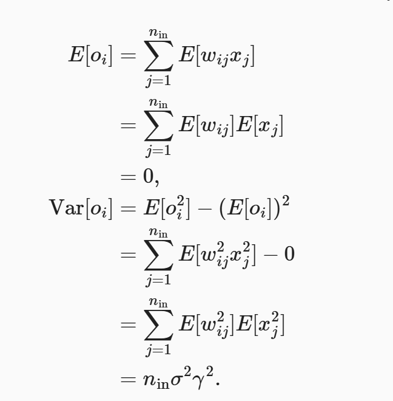
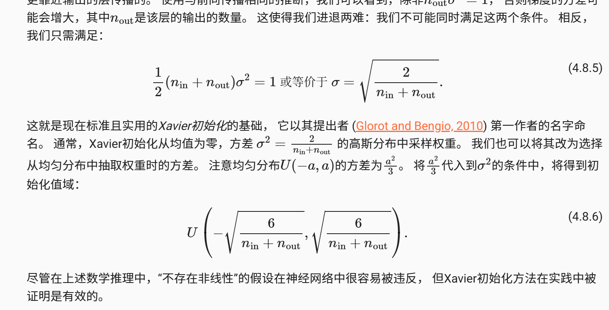

# 背景
初始化参数在神经网络中有着举足轻重的地位。它对保持数值稳定性至关重要。 此外，这些初始化方案的选择可以与非线性激活函数的选择有趣的结合在一起。 我们选择哪个函数以及如何初始化参数可以决定优化算法收敛的速度有多快。 糟糕选择可能会导致我们在训练时遇到梯度爆炸或梯度消失。

# 梯度消失
为什么梯度消失？

当反向传播的时候，如果某一层的梯度是0或者很小，那么乘回去就都是0了

因此使用ReLu更加稳定

# 梯度爆炸

梯度爆炸与梯度损失是相反的，往往出现在初始化参数不好，导致梯度很大，优化器根本没机会下降。

# 对称性
首先以MLP为例子，我们对一个隐藏层的权重参数进行重排列，同样对输出层进行一样的重拍列，对输出并无影响， 第一个隐藏单元与第二个隐藏单元没有什么特别的区别。 换句话说，我们在每一层的隐藏单元之间具有排列对称性。

如果在所以单元在初始化的时候给同样的权重量，那么正向传播的时候会产生一模一样的激活值，然后到了反向传播，也会发生一样的梯度计算，这样的网络迭代好像没什么意义，你始终相当于每层网络只有一个神经元，但是也有解决办法，上次提到的暂退法正则化，给定一定参数的dropout就可以避免这个问题

# 初始化参数

神经网络在我们没有指定要求的时候，它会随机初始化，其实对于中等难度来看，这是好的，也可以使用正态分布进行初始化

# Xavier 初始化
即使是正太分布初始化，也只是做到了随机，并没解决梯度爆炸和梯度消失，所以有一个聪明的办法Xavier初始化

根据数学公式，分析out的方差和均值发现

控制梯度不爆炸和不消失。其实每一层的梯度来源于上一层的梯度，

如果前一层的输出值 o_i 的尺度（方差）非常大，那么计算出的本层梯度也容易变得非常大。反之，如果前一层的输出值尺度非常小，梯度也容易变得非常小。

因此，控制每一层输出值的方差，是控制最终梯度大小的前提和基础。

所以Xavier在设计初始化方案时，强制让每一层的输出值的方差，尽可能与其输入值的方差保持一致。

